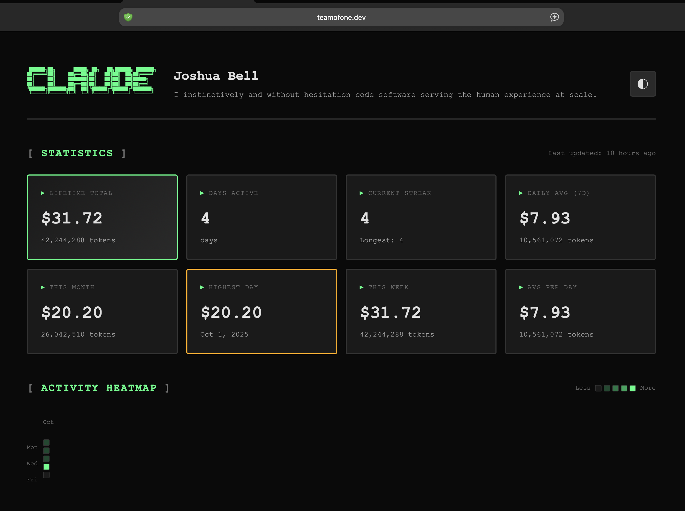

# Claude Code Usage Analytics Dashboard

A self-hosted, single-user analytics dashboard for tracking your Claude Code usage statistics. Deploy for free on GitHub Pages with zero configuration.



**[View Live Example →](https://teamofone.dev)**


## Features

- **Comprehensive Stats**: Lifetime, daily, weekly, and monthly usage metrics
- **Streak Tracking**: Monitor your current and longest usage streaks
- **Activity Heatmap**: GitHub-style contribution graph of your usage
- **Activity Timeline**: Paginated daily usage breakdown
- **Dynamic ASCII Art**: Your name rendered as ASCII art in the header
- **Dark/Light Mode**: Automatic theme switching with preference persistence
- **Zero Config**: No databases, no API keys, no external services
- **Git-Based Storage**: All stats stored as JSON files in your repo
- **Deploy Anywhere**: GitHub Pages, Cloudflare Pages, Netlify, or any static host

## Quick Start (3 steps, < 5 minutes)

### 1. Fork & Clone

```bash
# Fork this repo on GitHub, then:
git clone https://github.com/YOUR_USERNAME/claude-code-stats-dashboard.git
cd claude-code-stats-dashboard
npm install
```

### 2. Configure Your Profile

Edit `config.js` with your info:

```javascript
window.CONFIG = {
  userName: 'Your Name',  // Displayed as ASCII art in header
  userBio: 'Your bio here',
  socials: {
    github: 'yourusername',
    twitter: 'yourhandle',
    // ...
  }
};
```

### 3. Upload Your Data

```bash
# Generate and commit your usage stats
npm run upload

# Push to GitHub (triggers auto-deployment)
git add .
git commit -m "Add my usage stats"
git push
```

**That's it!** Your dashboard will be live at `https://YOUR_USERNAME.github.io/claude-code-stats-dashboard` in ~1 minute.

## Detailed Setup

### Enable GitHub Pages

1. Go to your repo on GitHub
2. Click **Settings** → **Pages**
3. Under **Build and deployment**:
   - **Source**: GitHub Actions
4. Done! GitHub will auto-deploy on every push

### Custom Domain (Optional)

Want `stats.yourdomain.com` instead of `username.github.io/repo`?

1. Add a `CNAME` file to the root of your repo:
   ```bash
   echo "stats.yourdomain.com" > CNAME
   ```

2. Add DNS records at your domain provider:
   ```
   A    @    185.199.108.153
   A    @    185.199.109.153
   A    @    185.199.110.153
   A    @    185.199.111.153
   ```
   Or for subdomain:
   ```
   CNAME stats YOUR_USERNAME.github.io
   ```

3. Push and wait for DNS propagation (~10 min to 24 hrs)

GitHub provides **free SSL certificates** automatically!

## Updating Your Stats

### Manual Upload

```bash
npm run upload      # Generates stats from ccusage
npm run deploy      # Commits and pushes to GitHub
```

### Automatic Daily Updates (Recommended)

Set up a cron job:

```bash
# Add to your crontab (crontab -e)
0 23 * * * cd /path/to/claude-code-stats-dashboard && npm run upload && npm run deploy
```

This runs every day at 11 PM, updates your stats, and pushes to GitHub.

## Project Structure

```
.
├── index.html             # Main dashboard page
├── config.js              # YOUR CONFIGURATION (edit this!)
├── css/
│   └── style.css          # Dashboard styles
├── js/
│   └── app.js             # Dashboard logic (ASCII art, pagination, heatmap)
├── data/                   # Generated stats (auto-created)
│   ├── stats.json         # Computed statistics
│   └── days.json          # Daily usage data
├── images/
│   └── example-site.png   # Screenshot for README
├── scripts/
│   └── upload.js          # Data upload script
├── .github/
│   └── workflows/
│       └── pages.yml      # GitHub Pages deployment
└── package.json           # npm scripts
```

## How It Works

1. **Data Collection**: `npm run upload` runs `ccusage` to collect your Claude Code usage data
2. **Processing**: The script processes the data and calculates statistics locally
3. **Storage**: Results are saved as JSON files in `data/`
4. **Commit**: You commit the updated files to your repo
5. **Deploy**: Push to GitHub → GitHub Actions deploys to Pages
6. **Display**: The dashboard loads and displays the data (no backend required!)

## Configuration

Edit `config.js` to customize your dashboard:

```javascript
window.CONFIG = {
  // Profile
  userName: 'Your Name',        // Rendered as ASCII art in header
  userEmail: 'your@email.com',
  userBio: 'Developer & AI enthusiast',
  userLocation: 'San Francisco, CA',
  userTimezone: 'America/Los_Angeles',

  // Social links (leave blank to hide)
  socials: {
    github: 'yourusername',
    twitter: 'yourhandle',
    linkedin: 'https://linkedin.com/in/yourprofile',
    website: 'https://yoursite.com'
  },

  // Site metadata
  siteTitle: 'Claude Code Usage Stats',
  siteDescription: 'My personal Claude Code analytics'
};
```

Changes take effect on next deployment (just `git push`).

## Customization

### Change Theme Colors

Edit `css/style.css`:

```css
:root[data-theme="dark"] {
  --bg-primary: #0a0a0a;
  --accent: #00ff88;      /* Change this! */
  /* ... more variables */
}
```

### Modify Stats Display

Edit `js/app.js` to change calculations or add new metrics.

## Deploy to Other Platforms

This dashboard works on ANY static host. Here are quick guides:

### Cloudflare Pages

1. Connect your GitHub repo
2. Build command: (leave empty)
3. Build output directory: `.` (root)
4. Deploy!

### Netlify

1. Connect your GitHub repo
2. Build command: (leave empty)
3. Publish directory: `.` (root)
4. Deploy!

### Vercel

```bash
npm install -g vercel
vercel
# Follow prompts, set output directory to "."
```

All platforms support custom domains with free SSL.

## Important Notes

### Single Machine Usage

This dashboard is designed for **single-developer, single-machine usage**. Claude Code tracks usage data locally on each machine.

**Multi-machine considerations:**
- If you run `npm run upload` from multiple machines, the most recent upload will overwrite previous data
- For multiple machines, consider:
  - Deploying separate dashboard instances per machine
  - Using only one primary machine for uploads
  - Manually merging data (advanced)

### Data Privacy

Your usage stats are stored in your public GitHub repo by default. If you want to keep your data private:

1. Make your repo private (Settings → Danger Zone → Change visibility)
2. GitHub Pages still works with private repos (for Pro accounts)
3. Or use Cloudflare Pages/Netlify (both support private repos for free)

## Development

### Local Testing

```bash
# Serve locally (from repo root)
npx http-server . -p 3000

# Or use any static server
python3 -m http.server 3000
```

Visit `http://localhost:3000`

## npm Scripts

```bash
npm run upload    # Run ccusage, process data, save to data/
npm run deploy    # Commit and push changes to GitHub
```

Combine them:
```bash
npm run upload && npm run deploy
```

## Troubleshooting

### Dashboard shows no data

1. Check that `data/stats.json` and `data/days.json` exist
2. Run `npm run upload` to generate them
3. Commit and push the files
4. Wait ~1 minute for GitHub Pages to deploy

### Stats not updating

1. Make sure you committed the updated JSON files
2. Check GitHub Actions tab for deployment status
3. Hard refresh your browser: `Cmd+Shift+R` (Mac) or `Ctrl+Shift+R` (Windows)

### Custom domain not working

1. Verify `CNAME` file is in the root directory and committed
2. Check DNS records are correct
3. Wait for DNS propagation (up to 24 hours, usually < 1 hour)
4. GitHub Pages → Settings → check for errors

### Upload script fails

1. Make sure `ccusage` is installed: `npm install`
2. Check that you have Claude Code usage data: `npx ccusage --json`
3. Ensure Node.js >= 18

## Contributing

Contributions welcome! Feel free to:
- Open issues for bugs or feature requests
- Submit PRs for improvements
- Share your customized dashboards!

## License

MIT License - see LICENSE file for details

## Credits

- Built for [Claude Code](https://claude.ai/code) users
- Uses [ccusage](https://github.com/brightbitcode/ccusage) for data collection
- Deployed on [GitHub Pages](https://pages.github.com/) (free forever!)

## Show Your Support

If you found this useful, give it a star on GitHub!

---

**Made with Claude Code**

Need help? [Open an issue](https://github.com/yourusername/claude-code-stats-dashboard/issues)
